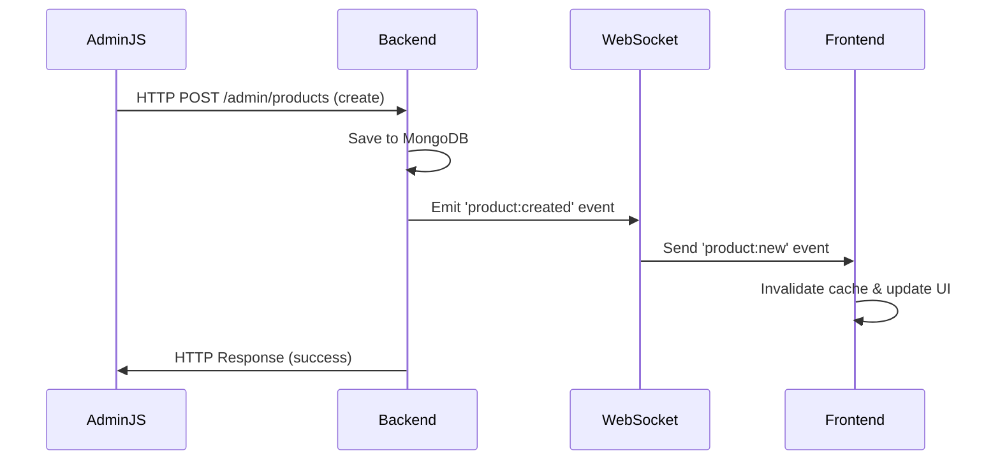
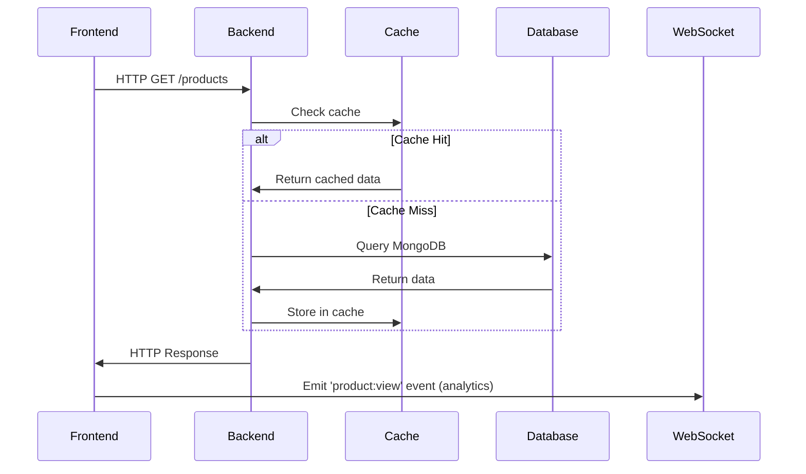
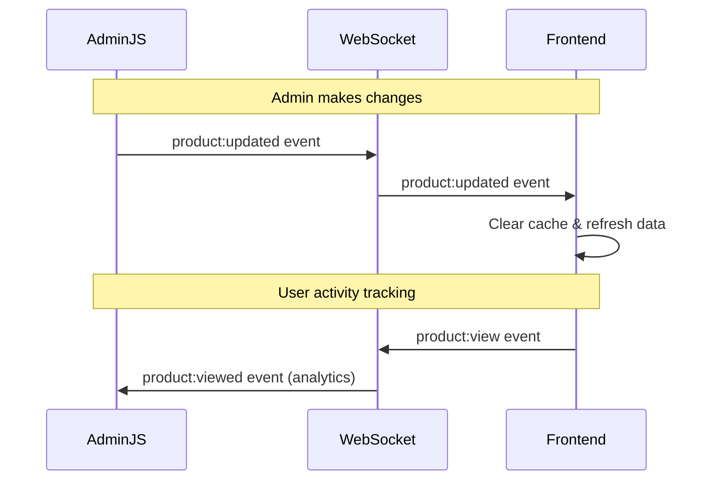

# 🔌 Complete Axios + WebSocket Real-time Setup Guide

## 🎯 Overview

This guide implements a complete real-time communication system between AdminJS, Backend, and Frontend using:

- **Axios** for HTTP API calls with intelligent caching
- **Socket.IO** for real-time WebSocket communication
- **Event-driven architecture** for instant updates
- **Dual-layer synchronization** (HTTP + WebSocket)

## 🏗️ Architecture Diagram

```
┌─────────────────┐    ┌─────────────────┐    ┌─────────────────┐
│    AdminJS      │────│     Backend     │────│    Frontend     │
│   Interface     │    │   (Express +    │    │ (React Native)  │
│                 │    │   Socket.IO)    │    │                 │
└─────────────────┘    └─────────────────┘    └─────────────────┘
        │ ▲                       │ ▲                       │ ▲
        │ │              ┌────────┴─┴────────┐              │ │
        │ │              │                   │              │ │
        │ │              │   WebSocket       │              │ │
        │ │              │   Server          │              │ │
        │ │              │   (Socket.IO)     │              │ │
        │ │              │                   │              │ │
        │ │              └────────┬─┬────────┘              │ │
        │ │                       │ │                       │ │
        └─┼───────────────────────┼─┼───────────────────────┼─┘
          │        Real-time Events │ │    Real-time Events   │
          │                         │ │                       │
          ▼                         ▼ ▼                       ▼
     HTTP Requests              WebSocket Events         HTTP Requests
     (Axios)                   (Bidirectional)          (Axios)
```

## 🚀 Data Flow Process

### 1. **Admin Creates Product** (AdminJS → Backend → Frontend)



### 2. **Frontend Fetches Data** (Frontend → Backend)


### 3. **Real-time Sync** (Bidirectional)


## 📦 Dependencies to Install

### Backend Dependencies
```bash
cd backend
npm install socket.io socket.io-client
```

### Frontend Dependencies  
```bash
cd geekapp
npm install socket.io-client
```

## 🔧 Configuration Files

### 1. Environment Variables (.env)
```env
# WebSocket Configuration
WEBSOCKET_PORT=8000
WEBSOCKET_ORIGINS=http://localhost:3000,http://localhost:19006

# API Configuration
API_BASE_URL=http://localhost:8000
JWT_SECRET=your-jwt-secret-key

# AdminJS Configuration
ADMIN_COOKIE_PASSWORD=your-admin-cookie-secret
SESSION_SECRET=your-session-secret
```

### 2. Frontend Environment (.env.local)
```env
EXPO_PUBLIC_API_URL=http://localhost:8000/api/v1
EXPO_PUBLIC_API_BASE_URL=http://localhost:8000
```

## 🎮 Usage Examples

### Frontend Component with Real-time Updates
```typescript
import React, { useEffect } from 'react';
import { useWebSocket, useRealTimeProducts } from '../hooks/useWebSocket';
import { useProducts } from '../hooks/useProducts';

const ProductsScreen = () => {
  const { connected, notifications, unreadCount } = useWebSocket();
  const { new: newProducts, updated, deleted } = useRealTimeProducts();
  const { products, refetch } = useProducts();

  useEffect(() => {
    // Refresh products when real-time updates arrive
    if (newProducts.length > 0 || updated.length > 0 || deleted.length > 0) {
      refetch();
    }
  }, [newProducts, updated, deleted, refetch]);

  return (
    <View>
      {/* Connection Status */}
      <Text style={{ color: connected ? 'green' : 'red' }}>
        {connected ? '🟢 Connected' : '🔴 Disconnected'}
      </Text>

      {/* Unread Notifications */}
      {unreadCount > 0 && (
        <Text>📢 {unreadCount} new notifications</Text>
      )}

      {/* Real-time Updates Banner */}
      {newProducts.length > 0 && (
        <Text>🆕 {newProducts.length} new products available!</Text>
      )}

      {/* Your product list component */}
      <ProductList products={products} />
    </View>
  );
};
```

### AdminJS Custom Dashboard with Real-time Analytics
```javascript
// backend/src/admin/components/RealTimeDashboard.jsx
import React, { useEffect, useState } from 'react';

const RealTimeDashboard = () => {
  const [analytics, setAnalytics] = useState({
    connectedUsers: 0,
    productViews: [],
    recentSearches: []
  });

  useEffect(() => {
    // This would connect to your WebSocket analytics
    // Implementation depends on your AdminJS component setup
    const updateAnalytics = () => {
      if (global.adminDashboard?.realTimeData) {
        setAnalytics(global.adminDashboard.realTimeData);
      }
    };

    const interval = setInterval(updateAnalytics, 1000);
    return () => clearInterval(interval);
  }, []);

  return (
    <div>
      <h2>📊 Real-time Dashboard</h2>
      <p>Connected Users: {analytics.connectedUsers}</p>
      <p>Recent Product Views: {analytics.productViews.length}</p>
      <p>Recent Searches: {analytics.recentSearches.length}</p>
    </div>
  );
};

export default RealTimeDashboard;
```

## 🔄 Event System

### WebSocket Events Reference

#### 📦 Product Events
- `product:new` - New product created
- `product:updated` - Product modified  
- `product:deleted` - Product removed
- `product:view` - Product viewed (analytics)
- `product:search` - Product searched (analytics)

#### 🛒 Order Events
- `order:created` - New order placed
- `order:updated` - Order status changed
- `order:status_update` - Order status notification

#### 👑 Admin Events
- `admin:notification` - Admin broadcast message
- `admin:connected` - Admin comes online
- `admin:disconnected` - Admin goes offline
- `admin:analytics_data` - Real-time analytics update

## 🚀 Starting the System

### 1. Start Backend Server
```bash
cd backend
npm run dev
```
This starts:
- Express server on port 8000
- WebSocket server on port 8000
- AdminJS on http://localhost:8000/admin

### 2. Start Frontend
```bash
cd geekapp  
npm start
```

### 3. Test Real-time Flow
1. Open AdminJS: http://localhost:8000/admin
2. Open your mobile app
3. Create a product in AdminJS → See instant update in app
4. Browse products in app → See analytics in AdminJS

## 🔍 Monitoring & Debugging

### Backend Logs to Watch For
```bash
🔌 WebSocket server initialized
👑 Admin connected: socket-id-123
📱 Client connected: socket-id-456
📦 New product created: iPhone 15
📡 Emitted product:created event
✅ Product cache invalidated
```

### Frontend Console Logs
```bash
🔗 Frontend connections initialized  
✅ WebSocket connected: socket-id-456
📦 New product received: iPhone 15
🗑️ Cache cleared due to product update
📱 UI refreshed with new data
```

### Testing WebSocket Connection
```bash
# Test WebSocket health
curl http://localhost:8000/api/v1/websocket/health

# Check connected clients (admin only)
curl -H "Authorization: Bearer admin-token" \
     http://localhost:8000/api/v1/websocket/stats
```

## ⚡ Performance Optimizations

### 1. **Intelligent Caching**
- HTTP responses cached for 5 minutes
- WebSocket events invalidate relevant caches
- Client-side AsyncStorage for offline support

### 2. **Event Batching**
```javascript
// Backend batches similar events
const batchedEvents = {
  'product:bulk_update': products => {
    wsManager.broadcastToClients('products:bulk_updated', products);
  }
};
```

### 3. **Connection Pooling**
- Reuse WebSocket connections
- Automatic reconnection with exponential backoff
- Connection health monitoring

## 🛡️ Error Handling

### Connection Failures
```typescript
const { connected, error, reconnect } = useWebSocket();

if (error) {
  // Show retry UI
  <TouchableOpacity onPress={reconnect}>
    <Text>🔄 Reconnect</Text>
  </TouchableOpacity>
}
```

### API Fallbacks
```typescript
// Axios automatically falls back to cached data
try {
  const products = await productService.getAllProducts();
} catch (error) {
  // Service automatically returns cached data if available
  console.log('Using cached data as fallback');
}
```

## 🎯 Advanced Features

### 1. **Typing Indicators**
```javascript
// When admin is editing a product
webSocketService.emit('admin:typing', { resource: 'product', id: '123' });
```

### 2. **Real-time Collaboration**
```javascript
// Multiple admins editing simultaneously  
webSocketService.emit('admin:editing', { 
  resource: 'product', 
  id: '123', 
  adminId: 'admin-456' 
});
```

### 3. **Push Notifications**
```javascript
// Trigger push notifications for important events
webSocketService.on('order:created', (order) => {
  sendPushNotification('New Order', `Order #${order.id} received`);
});
```

## 🔧 Troubleshooting

### Common Issues

1. **WebSocket Connection Failed**
   - Check if server is running on correct port
   - Verify CORS settings
   - Check firewall/network permissions

2. **Events Not Received**
   - Check event name spelling
   - Verify client is in correct room
   - Check authentication tokens

3. **Cache Not Invalidating**
   - Verify WebSocket events are being emitted
   - Check cache keys match
   - Monitor console logs for errors

### Debug Tools
```javascript
// Check WebSocket status
console.log(webSocketService.getConnectionStatus());

// Check cache statistics  
console.log(await checkConnectionHealth());

// Monitor all WebSocket events
webSocketService.socket?.onAny((event, data) => {
  console.log(`WebSocket Event: ${event}`, data);
});
```

## ✅ Testing Checklist

- [ ] Backend server starts with WebSocket
- [ ] AdminJS connects to WebSocket
- [ ] Frontend connects to WebSocket  
- [ ] Create product in AdminJS → Frontend receives update
- [ ] Update product in AdminJS → Frontend receives update
- [ ] Delete product in AdminJS → Frontend receives update
- [ ] Frontend product view → AdminJS receives analytics
- [ ] Cache invalidation works correctly
- [ ] Reconnection works after network loss
- [ ] Error handling displays properly

Your real-time system is now ready! 🚀

The combination of Axios + WebSocket provides:
- **Instant updates** between admin and users
- **Intelligent caching** for optimal performance  
- **Reliable fallbacks** for network issues
- **Real-time analytics** for admin insights
- **Scalable architecture** for future growth